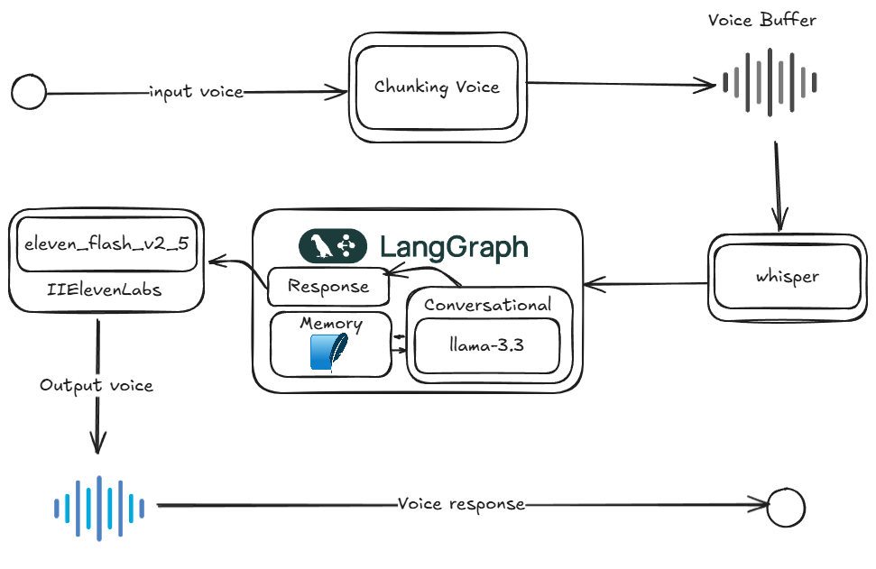

# Voice Agent

## Sobre o Projeto
Este é o primeiro desafio da série 7xAI, onde o objetivo é criar um agente de inteligência artificial por dia durante uma semana. O Voice Agent é um protótipo funcional de um agente de voz que pode responder perguntas e fornecer respostas em áudio.

## Desafio 7xAI
O desafio 7xAI consiste em desenvolver 7 diferentes agentes de IA em 7 dias, explorando diversas capacidades e aplicações da inteligência artificial. Este repositório contém o resultado do primeiro dia do desafio.

## Licença
Veja o arquivo [LICENSE](LICENSE) para mais detalhes.